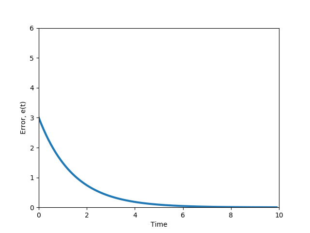

# MODULE 6 : GRADED QUIZ


<br><br>

**1.** Which reference path is the **most compact** and **easy to construct**?

**Ans :**

- [x] Track straight line segment


- [ ] Track waypoints


- [ ] Track parameterized curves


- [ ] None of the above


```
Correct! The easiest approach is to define a sequence of straight line segments, by requiring a sequence of endpoint vertices 
that are connected linearly. This path definition can be very compact and easy to construct, assuming points are well spaced 
and the environment allows for mostly straight line motion.
```

<br><br>

**2. ** What is the most **ACCURATE** and **PRECISE** definition of the crosstrack error?

**Ans :** 

- [ ] The crosstrack error is the difference between path heading and the vehicle heading at a reference point along the path


- [x] The crosstrack error is the distance between the vehicle reference point and the closest point on the reference path


- [ ] The crosstrack error is the sum of the absolute difference between each coordinate of the vehicle reference point and the corresponding closest point on the desired path


- [ ] None of the above

```
Correct! It is the principle measure of how close the vehicle’s position is to the desired position along the path.
```

<br><br>

**3.** What vehicle reference frame is used in a **pure pursuit controller**?

**Ans :**

- [ ] Center of gravity


- [ ] Center of the front axle


- [x] Center of the rear axle


- [ ] None of the above

```
Correct! In this method, the centre of the rear axle is used as the vehicle reference frame. Also, recall that we define the line that 
connects the centre of the rear axle to the target reference point as the lookahead distance.
```
<br><br>

**4.** **Compute the radius** from the instantaneous center of rotation to the center of the vehicle rear axle  (in m) required for an 
autonomous vehicle to follow the desired path based on the information below.

The lookahead distance is 10 m; the car length is 4 m; the angle between the vehicle’s body heading and the lookahead line is 30°. Your answer should be an integer. 

**Ans :** 10


<br><br>

**5.** **Compute the steering angle (in degrees)** required for an autonomous vehicle with pure pursuit lateral control for following the desired path based on the information below.

The lookahead distance is 15 m; the car length is 5 m; the angle between the vehicle’s body heading and the lookahead line is 60°.

**Ans :** 30


 
<br><br>

**6.** Consider a  situation in which a vehicle traveling speed has decreased from 100 km/h to 50 km/h. This vehicle lateral control is implemented 
with a pure pursuit controller where ld is assigned as a function of vehicle speed. **How should ld change in this situation?** 

**Ans :** 

- [ ]  should increase
​	
- [x]   should decrease

- [ ]   should stay the same

- [ ]   can increase or decrease depending on how the controller is tuned

- [ ] None of the above

```
Correct! The pursuit controller with a fixed value of ld does not take into account the vehicle speed. This means that the 
selected steering angle would be the same regardless of whether the vehicle is going 10 km/h or 100 km/h, leading to very 
different lateral accelerations. A controller tuned for high speed would be far to sluggish at low speed, and one tuned for
low speed would be dangerously aggressive at high speed. To overcome this limitation, we define the lookahead distance to 
increase proportional to vehicle forward speed
```
<br><br>

**7. ** What are **major components** of the Stanley controller?  (Select all that apply)

**Ans :** 


- [x] Proportional control is introduced for minimizing the crosstrack error

```
Correct! This is a major component of the Stanley controller that differs it from the pure pursuit controller.
```

- [x] Steering angle command is restricted to the min and max steering angles

```
Correct! This is a major component of the Stanley controller that differs it from the pure pursuit controller.
```

- [x] Steering angle is set equal to the heading direction to eliminate heading error relative to the path

```
Correct! This is a major component of the Stanley controller that differs it from the pure pursuit controller
```

- [ ] Derivative control is introduced for minimizing the heading error
- [ ] Integral control is added for both the heading and the crosstrack errors optimization 
- [ ] Crosstrack error is eliminated


<br><br>

**8. ** **What is the correct figure** of the crosstrack error dynamics for a small error value(where e′(t)=−ke(t)) ?

**Ans :**


```
Correct! Solving the differential equation of the crosstrack error dynamic results in the following function
```
 
```
  and this function is plotted above
```

<br><br>

**9. ** **What is the value of the crosstrack error**, governed by the ODE e′(t)=−ke(t), at t=2 given that e(0)=4 and k=1?

**Ans :** 0.54

```
Correct! Solving the differential equation of the crosstrack error results in the following function:
```
 
```
Next, using the given values we get:
```


<br><br>

**10. ** Which of the statements below about Model Predictive Control (MPC) are **TRUE**? (Select all that apply)

**Ans :** 


- [x] MPC works for both linear and nonlinear models

```
Correct! The controller can be explicitly applied to the linear or nonlinear models of the vehicle and its subsystems, 
meaning that we can use the same approach even as our models change or improve over time.
```

- [x] MPC can impose constraints on the states and the input simultaneously

```
Correct! The states and control signals in MPC can be constrained to stay within safe operating bounds, and controls can be 
selected to maximize multiple objectives simultaneously. Both hard constraints and soft penalties can be employed, leading 
to a rich set of solutions for constrained control problems.
```

- [x] The formulation of an MPC controller is straightforward

```
Correct! The formulation of an MPC controller is straightforward, requiring the definition of an objective function and relevant 
constraints that are then optimized using well-established solvers
```
- [ ] MPC is an optimized version of Receding Horizon Control


<br><br>

**11. ** What is the typical way of finding the solution for a **nonlinear vehicle dynamics model** given an input function?

**Ans :**


- [ ] Laplace transform


- [x] Numerical optimization


- [ ] Using existing closed form solution


- [ ] None of the above

```
Correct! No closed form solution exists for a nonlinear dynamic model, and so we rely on numerical optimization to find a solution.
```
<br><br>

**12. ** What is the output of the **Model Predictive Controller** described in this course? (Select all that apply)

**Ans :** 


- [ ] Throttling/braking


- [ ] Steering angle


- [x] Longitudinal forces

```
Correct! The Model Predictive Control takes the reference path, velocity and the vehicle states at each time step as an 
input and outputs the longitudinal force needed to follow the desired trajectory.
```

- [x] Lateral forces

```
Correct! The Model Predictive Control takes the reference path, velocity and the vehicle states at each time step as an 
input and outputs the lateral force needed to follow the desired trajectory.
```

- [ ] None of the above

