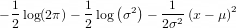
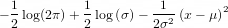
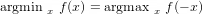

# Lesson 2: Practice Quiz
---

**Question 1.**
The method of maximum likelihood gives the same parameter estimates as the method of least squares for any measurement noise distribution.

- [ ] True

- [x] False
``
Correct
Correct! The noise must be from the Gaussian family.
``

**Question 2**
The product of several Gaussian PDFs with identical variances is also Gaussian.

- [x] True

- [ ] False
```
Correct
Correct! We used this fact to derive the connection between maximum likelihood and least squares.
```

**Question 3.**
The least squares criterion is robust to outliers.

- [ ] True

- [x] False
```
Correct
Correct! Least squares is particularly sensitive to outliers due to the use of squared errors!
```

**Question 4.**
For a scalar Gaussian random variable, what is the form of the full log likelihood function?


- [x] 
- [ ] 

```
Correct
Correct!
```

**Question 5.**
True or False, 
​
- [ ] True
- [x] False
