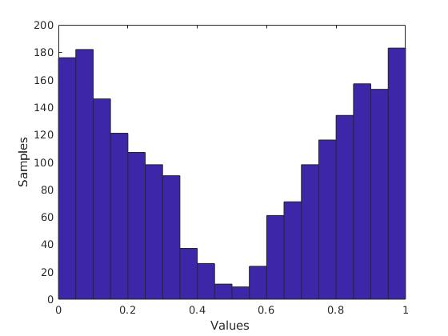

# Module 1: Graded Quiz
---

**Question 1.**
Measurements are drawn from a Gaussian distribution with variance \sigma^2σ2.Which of the estimators below will provide the 'best' estimate of the true value of a parameter? Select any/all that apply:

- [x] Weighed Least Squares
```
Correct
Correct! Even when all variances are identical, weighted least squares can
be applied.
```
- [x] Least Squares
```
Correct
Correct! Since all of the variances are identical, ordinary least squares can
be used.
```
- [x] Maximum Likelihood
```
Correct
Correct! By definition, a maximum likelihood estimator will find the parameter
value with the greatest likelihood of being the 'true' value. ML and LS
estimators are equivalent in this case.
```

**Question 2.**
Which of the following statements are correct? Select any/all that apply:


- [x] Least squares estimators are significantly affected by outliers.
```
Correct
Correct! Outliers are not well handled by least squares estimators, since these estimators minimize the sum of squared errors.
```

- [x] When measurement noise comes from a large number of independent sources, a least squares estimator can be used.
```
Correct
Correct! The Central Limit Theorem states that when a noise comes from a large
number of independent sources, the noise distribution will tend towards a
Gaussian distribution.
```

- [ ] When measurements are drawn from a non-Gaussian distribution, a maximum likelihood estimator produces the same values as weighted least squares.

**Question 3.**

Given the above histogram of noisy measurements, it is appropriate to use a LS estimator?

- [ ] True

- [x] False
```
Correct
Correct! The distribution of the measurements is clearly not Gaussian, which suggests that least squares will do a poor job.
```

**Question 4.**
Looking at the histogram in the previous question, what could be the reason for such a distribution of measurements? Select any/all that apply:

- [ ] There is an outside disturbance affecting the sensor.
```
Correct
Correct! Even if the measured value is static, a disturbance affecting the
sensor (e.g., unmodeled vibrations or someone moving the sensor) might
cause significantly different measurements to be produced.
```

- [ ] The measurement is affected by zero mean Gaussian noise.

- [x] The measured value might be changing.
```
Correct
Correct! If the measured value is changing (e.g., perhaps switching between two
discrete values), the histogram will have multiple peaks.
```
