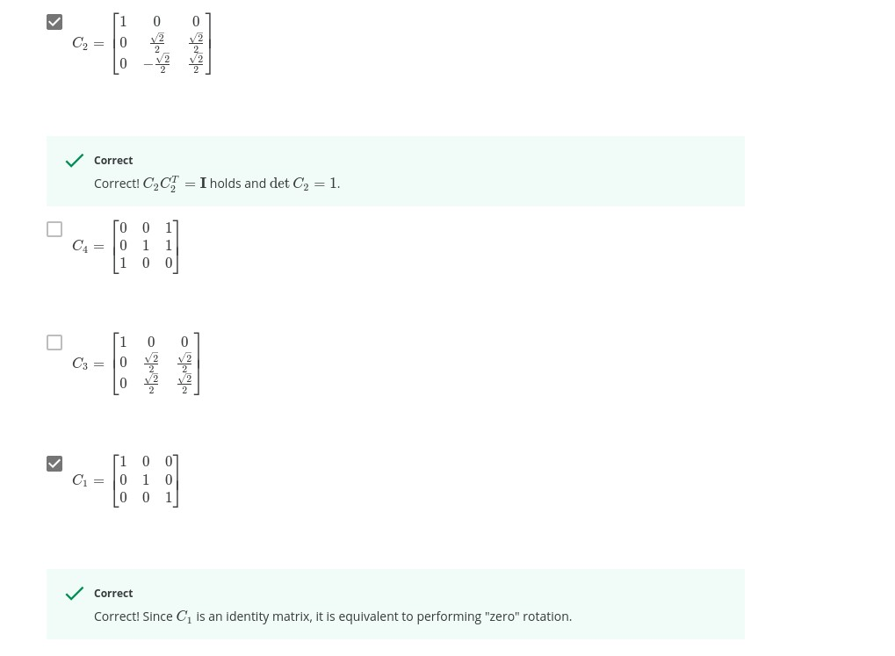

# Module 3 Graded Quiz
---
**Question 1.**
Which of these statements are true? Select any/all that apply:


- [ ] Every 3x3 matrix represents a 3D rotation.
- [x] Every unit quaternion has an associated 3x3 rotation matrix.
```
Correct
Correct! Every quaternion corresponds to a 3x3 rotation matrix.
```
- [x] Every set of Euler angles corresponds to a unit quaternion.
```
Correct
Correct! Any set of Euler angles represents a rotation which can also be represented by a unit quaternion.
```
**Question 2.**
Which of these are valid rotation matrices? Select any/all that apply:
<br><br>



<br><br>

**Question 3.**
Localization can be performed on board a vehicle by integrating the rotational velocities and linear accelerations measured by an IMU. Assuming that the IMU measurement noise is drawn from a normal distribution, what will the pose estimation error look like?

- [ ] The vehicle pose estimation error will grow with time.
- [ ] The vehicle pose estimate error will remain within a bounded interval.
- [x] The vehicle pose estimate error will decrease with time.
```
Correct
Correct! Since we are integrating noisy measurements, the error will build
up over time.
```

**Question 4.**
Each GPS satellite transmits a signal that encodes:

- [ ] The satellite's position and time of signal transmission.
- [x] The receiver's position and time of signal transmission
```
Correct
Correct! This information can be used to calculate the vehicle's position.
```

**Question 5.**
Which of these systems provides the most accurate positioning measurement?

- [x] RTK GPS
- [ ] GPS
- [ ] DGPS
```
Correct
Correct! RTK uses phase of the GPS carrier signal to provide
centimetre-level accuracy.
```

**Question 6.**
What is the minimum number of GPS satellites required to estimate the 3D position of a vehicle through trilateration?

**ANS: 4**

```
Correct
Correct! A minimum of four satellites is required to unambiguously calculate
the vehicle's 3D position.
```
