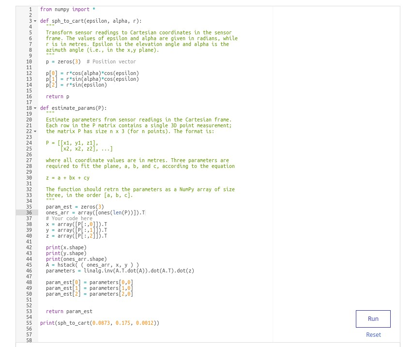
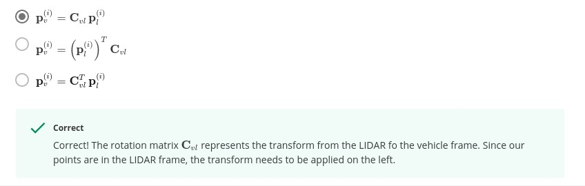

# Module 4: Graded Quiz

---


**Question 1.**
A single 3D LIDAR reading consists of elevation, azimuth and range measurements ((ϵ,α,r)=(5∘, 10∘,4 m) . Assuming that the measurements are noiseless, calculate the position of this point in the Cartesian sensor frame. Note that the elevation and azimuth angles are given in degrees (for convenience) - you will need to convert these values to radians for use with most trigonometric functions.

Enter your result in the area below as comma separated list of values, in the (x, y, z)(x,y,z) format, e.g (1.22, 2.33, 3.44).

**ANS: (3.92, 0.69, 0.35)**
<br><br>
**Question 2.**
A 3D LIDAR unit is scanning a surface that is approximately planar, returning range, elevation and azimuth measurements. In order to estimate the equation of the surface in parametric form (as a plane), we need to find a set of parameters that best fit the measurements.

Implement the sph_to_cat and estimate_params functions, which transform LIDAR measurements into a Cartesian coordinate frame and estimate the plane parameters, respectively. You may assume that measurement noise is negligible. The code comments provide more information on the format of the arguments to each function.

<br><br>


<br><br>

**Question 3.**
Which of the following statements are true? Select any/all that apply.

- [x] ICP is sensitive to outliers caused by moving objects.
```
Correct
Correct! Moving objects in the environment can cause incorrect matches between LIDAR scan points.
```
- [ ] Because the points in a 3D point cloud are defined in Euclidean space, estimating the transformation between two point clouds is possible using simple trigonometry.
- [ ] Point-to-plane ICP is often used in environments that lack structure.

**Question 4.**
You are testing an algorithm for LIDAR-based localization on a vehicle in a controlled environment. What are some of the things you need to take into account? Select any/all that apply.

- [x] When the vehicle is moving quickly, it is important to account for the time differences between individual LIDAR pulses.
```
Correct
Correct! This means that every single point in a LIDAR sweep is taken from a
slightly different position and a slightly different orientation, and this
can cause artifacts such as duplicated objects to appear in the LIDAR scans.
```

- [ ] The LIDAR always needs to be positioned horizontally, as even a small tilt will cause measurement errors.


- [ ] It is important to identify shiny and highly reflective objects in the environment, as LIDAR measurements of those objects may be invalid.
```
Correct
Correct! Shiny and polished surfaces may dramatically reduce the amount of light reflected back along the original beam direction. For example, if the surface
is very shiny, like a mirror, the laser pulse might be scattered completely
away from the original pulse direction.
```

- [ ] We need to make sure the environment is well lit.


**Question 5.**
To estimate the motion of a self-driving car, it is necessary to transform LIDAR scan points from the sensor frame to the vehicle frame. The rotation of the vehicle frame with respect to the LIDAR frame is represented by the rotation matrix \mathbf{C}_{vl}C
vl. Given any point \mathbf{p}^{(i)}_lpl(i) in the LIDAR frame, and considering rotation only, which of these expressions correctly transforms the point into the vehicle frame?


