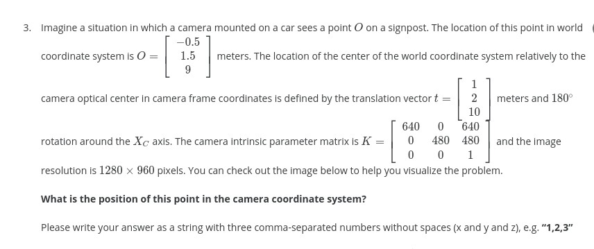
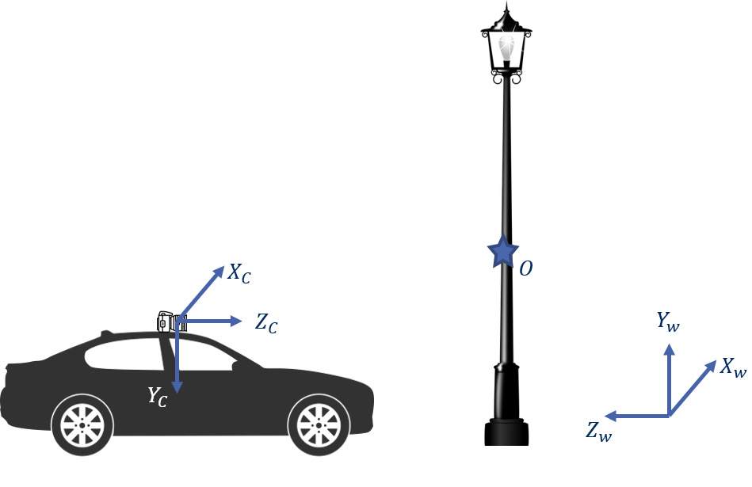
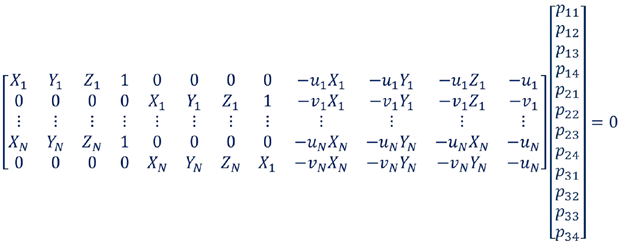
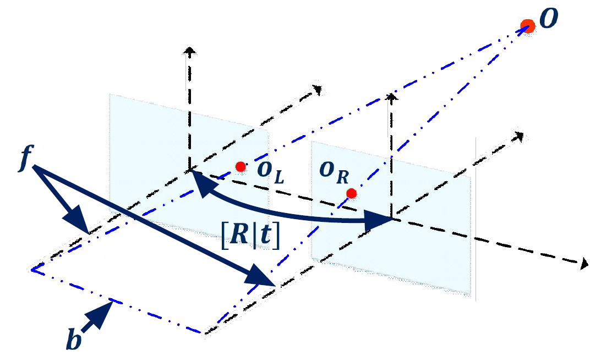
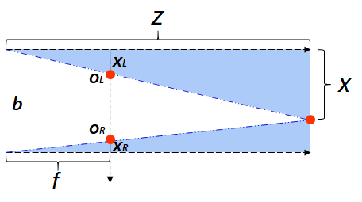
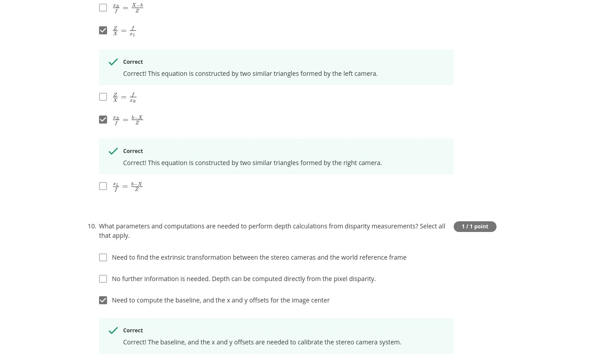
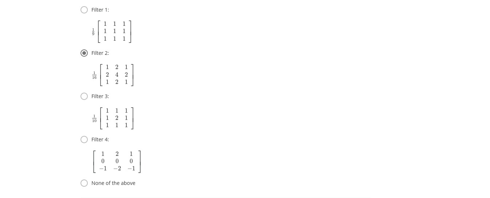

# Module 1 Graded Quiz
---

**Question 1.**
What is the most ACCURATE and PRECISE definition of the camera obscura?

- [ ] A passive exteroceptive sensor
- [ ] A mathematical model that describes relationship between world coordinates of a point and its projection onto the image plane
- [x] A box or room with a pinhole aperture in front of an imaging surface
- [ ] A tiny hole in a barrier through which light travels
- [ ] None of the above
```
Correct
Correct! Camera obscura, which translates to Dark Room Camera in English, is a
 simple construction with a pinhole aperture in front of an imaging surface.
```
<br><br>

**Question 2.**
Which of the following statements are TRUE? Select all that apply.

- [x] Camera extrinsic parameters include a rotation matrix.
```
Correct
Correct! Camera extrinsic parameters encompass both a rotation matrix and translation vector.
```
- [x] Camera extrinsic parameters define the transformations from 3D world coordinates to 3D camera coordinates
```
Correct
Correct! Camera extrinsic parameters indeed define the transformations from 3D world coordinates to 3D camera coordinates.
```
- [ ] Camera intrinsic parameters define the transformations from 3D camera coordinates to 3D world coordinates

- [ ] Camera extrinsic parameters include the focal length.

- [ ] Camera intrinsic parameters include a translation vector.

<br><br>

**Question 3.**


**ANS: "0.5,0.5,1"**
```
Correct
Correct! You properly located the position of the given point in camera
coordinate system.
```
<br><br>

**Question 4**
Based on the problem presented in the above question, what is the pixel location of the 2D projection of the point O on the image plane?

Please write your answer as a string with two comma-separated numbers without spaces (u and v), e.g. “100,100”

**ANS: "960,720"**
```
Correct
Correct! Recall that this point is located in the left bottom quarter of the image.
```
<br><br>

**Question 5.**
Why is camera calibration important in the self-driving car domain? Select all that apply.

- [x] Computed camera parameters can be used to determine the camera location relative to the scene
```
Correct
Correct! Determining the camera location using its intrinsic and extrinsic parameters is extensively used in the self-driving car domain, for visual odometry for example.
```
- [x] Computed camera parameters can be used to correct for lens distortion
```
Correct
Correct! Some complex camera calibration methods allow modeling and estimation of various sophisticated camera parameters such as radial distortion.
```

- [x] Computed camera parameters can be used to measure the size of a 2D object in 3D world units
```
Correct
Correct! Camera intrinsic and extrinsic parameters can be used for locating 3D points on a 2D image coordinate frame as well as locating 2D points in a 3D world coordinate system.
```

- [ ] Computed camera parameters can be used to determine the camera model
- [x] Camera calibration estimates the parameters of the lens and image sensor of a camera
```
Correct
Correct! Camera calibration is used to compute camera parameters whether in form of projection matrix or in form of intrinsic and extrinsic matrices.
```
<br><br>

**Question 6.**
Recall the camera calibration problem formulation, which has the following mathematical representation.

What methods from linear algebra can we use for solving this problem? Select all that apply.



- [ ] Gaussian Elimination
- [ ] Method of Complements
- [ ] Eigen Decomposition
- [x] Singular Value Decomposition
```
Correct
Correct! Singular Value Decomposition is the way to go. This problem might also be solved with RQ factorization.
```
- [ ] None of the above

<br><br>


**Question 7.**
Let's continue with the camera calibration formulation from the previous question.

What are some DISADVANTAGES of this linear calibration model? Select all that apply.

- [x] The linear model mixes the intrinsic and extrinsic camera parameters
```
Correct
Correct! Linear calibration model does not directly provide the intrinsic and extrinsic camera parameters.
```
- [ ] The linear model is computationally expensive
- [ ] The linear model does not allow for the incorporation of parameter constraints
```
Correct
Correct! The linear calibration model does not allow us to impose constraints on the solution, such as requiring the focal length to be non-negative.
```
- [x] Does not model radial distortion and other complex phenomena
```
Correct
Correct! The linear calibration model does not take into account complex phenomena such as radial and tangential distortion.
```
- [ ] None of the above

<br><br>

**Question 8.**
If the baseline between camera centers is known for a stereo rig, what limitation of monocular vision can be avoided?

- [ ] Motion blur
- [x] Inability to measure depth to a point
- [ ] Over exposure in bright lighting conditions
- [ ] Inability to measure angle to a point
- [ ] None of the above
```
Correct
Correct. Knowledge of the baseline between two camera centers allows the measurements of the same point in each image to be triangulated to identify depth, in the process known as Stereopsis.
```
<br><br>

**Question 9.**
Consider a stereo camera setup in the figures below, similar to what you saw in the course slides.

Which of the statement about this configuration are correct? Select all that apply.






<br><br>

**Question 10.**
What parameters and computations are needed to perform depth calculations from disparity measurements? Select all that apply.

- [ ] Need to find the extrinsic transformation between the stereo cameras and the world reference frame

- [ ] No further information is needed. Depth can be computed directly from the pixel disparity.

- [ ] Need to compute the baseline, and the x and y offsets for the image center
```
Correct
Correct! The baseline, and the x and y offsets are needed to calibrate the stereo camera system.
```
- [ ] Need to compute/know the focal length
```
Correct
Correct! The focal length is needed to calibrate the stereo camera system.
```
<br><br>

**Question 11.**
A naive solution for the stereo correspondence problem is an exhaustive search, where we search the whole right image for a match to every pixel in the left image. Why is this a bad approach? Select all that apply.

- [ ] It is a good approach, and none of the concerns above is valid
- [x] This approach generally could not run in real time
```
Correct
Correct! An exhaustive search for the stereo correspondence takes considerable amount of computation time.
```
- [ ] Radial and tangential distortion make it difficult to match corresponding pixels with this approach because it distorts each image differently
- [ ] An exhaustive search can be performed only when the left and right images are taken with the same camera model. Otherwise, the images are too different and cannot be compared
- [x] The naive approach results in a large number of incorrect matches due to similar pixels in different parts of the image
```
Correct
Correct! An exhaustive search for a stereo correspondence finds too many matches, which means that this strategy is unlikely to succeed.
```
<br><br>

**Question 12.**
What is the definition of an epipolar line for stereo cameras?

- [ ] A straight line connecting the left and right camera centers in a stereo setup
- [ ] A straight line connecting the optical center of a camera and a point in the scene
- [ ] A straight line that passes through the center of the lens and the camera sensor
- [x] A line produced in one camera as a point in 3D space is moved along a single ray emanating from the other camera's optical center
- [ ] None of the above
```
Correct
Correct! Recall that the epipolar line helps us to constrain the correspondence search to be along the epipolar line, reducing the search from 2D to 1D.
```
<br><br>

**Question 13.**
Recall that the first basic stereo algorithm which you saw in this module has four necessary steps. These steps are given to you below. Your task is to put them into correct order

(A) Compute disparity

(B) Pick the pixel that has minimum cost

(C) Consider each pixel on the epipolar line in the left image

(D) Compare the chosen pixels from the left image to every pixel in the right image on the same epipolar line

- [ ] (D), (C), (B), (A)
- [ ] (C), (D), (A), (B)
- [x] (C), (D), (B), (A)
- [ ] (C), (B), (D), (A)
```
Correct
Correct! This is correct order for computing disparity in a pair of stereo images.
```
<br><br>

**Question 14.**
Which of the below statements about correlation and convolution are correct?

- [ ] Template matching can only be performed with a convolution filter and not with a cross-correlation filter
- [x] A convolution kernel is a 180 degrees rotated cross-correlation kernel
```
Correct
Correct! You can see this from the convolution and cross-correlation equations.
```
- [x] A convolution filter and a cross-correlation filter are the same if the kernel is symmetric
```
Correct
Correct! You can see this from the convolution and cross-correlation equations.
```
- [x] The order of multiplication of convolution kernels does not matter
```
Correct
Correct! Convolution is associative.
```
- [ ] Cross-correlation is associative

<br><br>

**Question 15.**
Which of these 3X3 image filters is a Gaussian filter?


<br><br>
